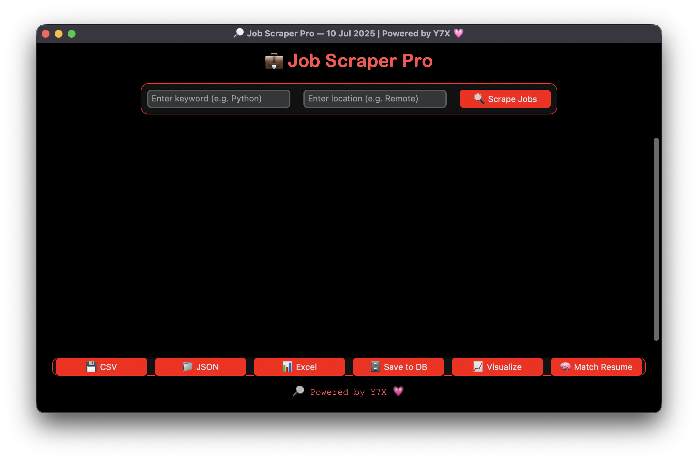
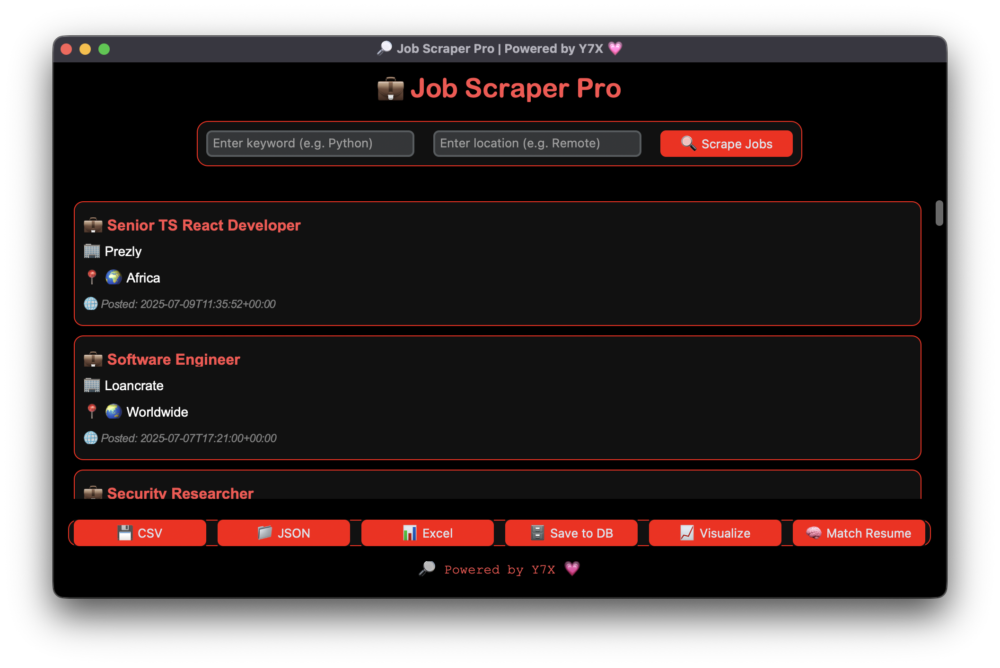

<div align="center">

# 💼 Job Scraper  
**💼 Job Scraper — remote jobs, resume match, export-ready.**

Scrape remote job listings, match with your resume using NLP, and export everything — all in a dark-glass GUI.  
Branded with 💗 by [Y7X-bit](https://github.com/Y7X-bit)




</div>

---

## 🌟 Features at a Glance

- 🔍 Scrape jobs by keyword + location (via RemoteOK)
- 🧠 Resume matching using `spaCy` NLP
- 📁 Export to CSV, JSON, Excel
- 🗄️ Save scraped jobs to SQLite DB
- 📈 Visualize job count by location (bar chart)
- 🧑‍💻 Glassy dark UI with red glow outlines
- 💾 Resume-friendly `.txt` format for clean input
- 💻 Fully built with `customtkinter`

---

## 🖥️ Installation

> ⚙️ Python 3.9+ recommended

```bash
git clone https://github.com/Y7X-bit/JobScraper.git
cd JobScraper
pip install -r requirements.txt
python main.py